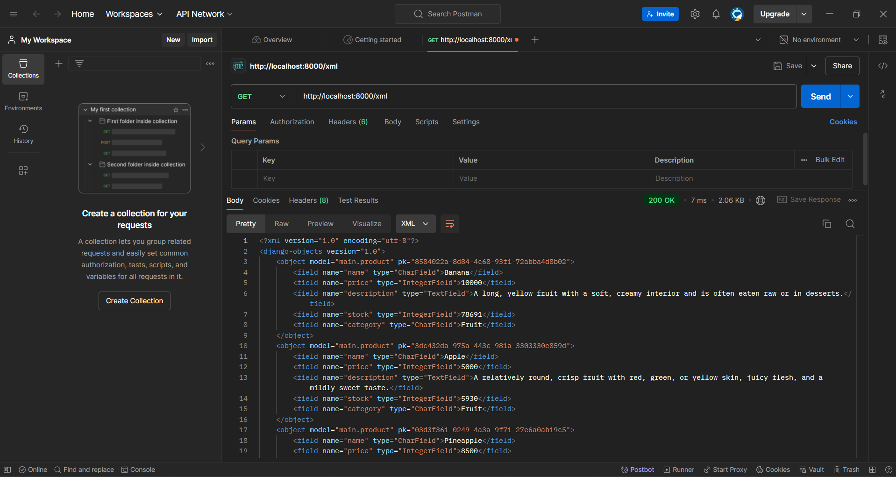
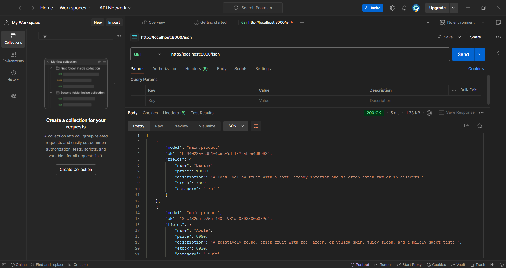
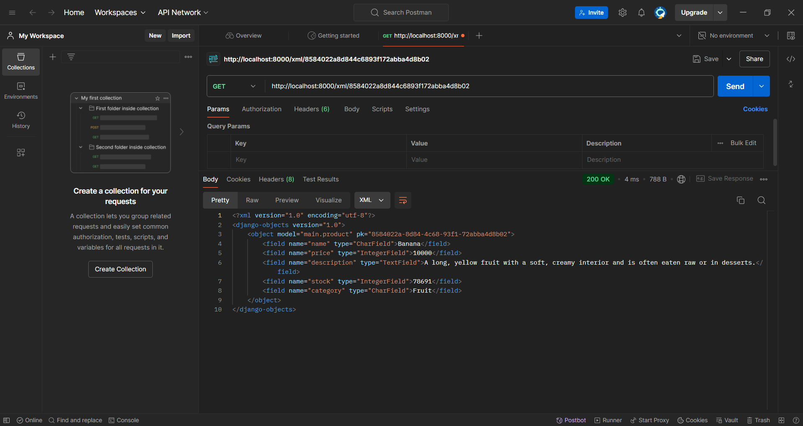
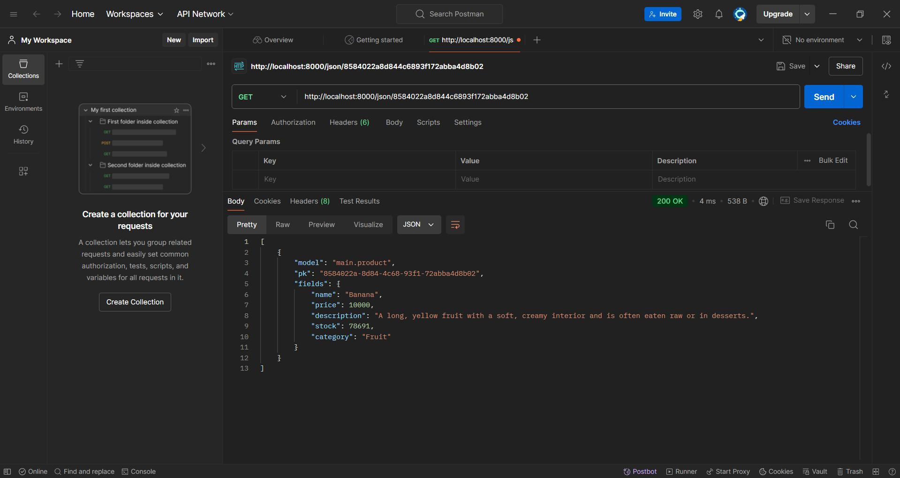
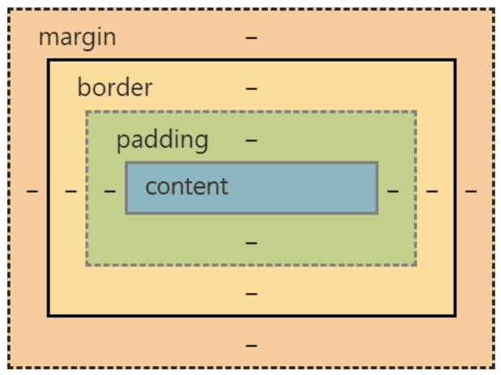

### PWS : http://orlando-devito-dodostore.pbp.cs.ui.ac.id
### Github : https://github.com/ThatTryHard/dodostore


### Tugas 2
- 1. Untuk membuat project django baru, pertama saya menggunakan command `python -m venv` env pada direktori utama yang akan saya gunakan untuk menyimpan projek utama saya, yang akan digunakan untuk mengisolasi package dan dependencies agar tidak mengalami conflicts dengan package lain. kemudian saya mengaktifkan virtual environment saya dengan command `env\Scripts\activate`. Dan pada direktori yang sama, saya membuat file `requirements.txt` yang berisikan dependencies untuk projek Djangonya, yaitu django, gunicorn, whitenoise, psycopg2-binary, requests, dan urllib3. Lalu dengan command `pip install -r requirements.txt` yang dijalankan dengan environment yang sedang aktif, akan menginstall semua library ini ke dalam sistem. Setelah semua terinstall, saya menggunakan command `django-admin startproject dodo_store .` untuk menginisiasi projek baru bernama `dodo_store` di direktori utama. Untuk kebutuhan deployment, saya menambahkan host pada `ALLOWED_HOSTS` di `settings.py`, yaitu `localhost` dan `127.0.0.1` agar dapat ditampilkan dalam jaringan saya. Setelah melakukan ini, saya dapat melihat animasi roket ketika membuka http://localhost:8000/ yang menandakan saya berhasil dalam penginstallan Django ini. Setelah semua terinstall, saya menutup servernya dengan command `deactivate` pada Command Prompt saya.

  2. Untuk membuat aplikasi pada project django saya, pertama saya membuka direktori utama proyek Djangonya, kemudian dengan command `env\Scripts\activate` saya mengaktifkan virtual environmentnya. Setelah itu, saya menjalankan command `python manage.py startapp main` untuk membuat aplikasi bernama `main`. Setelah aplikasi main sudah ada di direktori, saya menambahkan `main` kedalam variabel `INSTALLED_APPS` di dalam berkas `settings.py` pada direktori proyek `dodo_store`.

  3. Untuk routing, pertama saya melakukan pengubahan di berkas `urls.py` di dalam direktori proyek `dodo_store` yang berisikan:
        ```python
        from django.contrib import admin
        from django.urls import path, include

        urlpatterns = [
            path('admin/', admin.site.urls),
            path('', include('main.urls')),
        ]
        ```
        berkas file `urls.py` di direktori proyek `dodo_store` ini mengatur rute URL keseluruhan proyek, saya menggunakan `include` untuk mengimpor semua rute URL yang ada di `main` ke dalam proyek `dodo_store`. Dan pada path `''` diarahkan ke rute `main`, agar dapat diakses langsung.

  4. Untuk membuat model `Product` pada aplikasi `main`, saya membuka berkas `models.py` di direktori aplikasi `main` terlebih dahulu. Kemudian saya menambahkan class Product yang sebagai berikut:
        ```python
        from django.db import models
            
        class Product(models.Model):
            name = models.CharField(max_length=255)  #Product name
            price = models.IntegerField()  # Product price
            description = models.TextField()  # Product description

            stock = models.IntegerField(default=0)  # Product in stock
            category = models.CharField(max_length=100, blank=True, null=True)  # Product category

            def product_info(self):
                return f"{self.name} - Rp. {self.price:,} - {self.stock} is in stock - {self.category} category."
        ```
     dengan `models.Model` sebagai pendefinisian model di Django, dan `Product` sebagai nama model, saya mendefinisikan `name`, `price`, dan `description` sebagai atribut yang diwajibkan dengan menerima tipe data yang sesuai juga.Saya juga menambahkan atribut `stock` dan `category` sebagai atribut tambahan, serta fungsi `product_info()` yang akan mengembalikan informasi dari produknya. Setelah pembuatan model ini, saya membuat beberapa tests di `tests.py` untuk mengecek apakah prosesnya dapat dilakukan dengan tepat. dengan berkas yang sebagai berikut:
     ```python
     from django.test import TestCase, Client
     from django.utils import timezone
     from .models import Product

     class mainTest(TestCase):
         def test_main_url_is_exist(self):
             response = Client().get('')
             self.assertEqual(response.status_code, 200)

         def test_main_using_main_template(self):
             response = Client().get('')
             self.assertTemplateUsed(response, 'main.html')

         def test_nonexistent_page(self):
             response = Client().get('/nonexistant/')
             self.assertEqual(response.status_code, 404)

         def test_product_exist(self):
             product = Product.objects.create(
             name="Aqua",
             price = 4000,
             description = "a bottle of drinking water from the Aqua brand",
             stock = 1000,
             category = "Beverage",
             )
             self.assertTrue("Aqua - Rp. 4,000 - 1000 is in stock - Beverage category." == product.product_info())
     ```
     tests yang dijalankan adalah test untuk mengecek url main, apakah main menggunakan templatenya, test untuk mengecek halaman yang tidak ada, dan test untuk mengecek apakah produk ada atau tidak.

  5. Untuk menghubungkan views dengan template pada proses MVT, dapat dilakukan dengan cara membuat fungsi pada `views.py` di direktori aplikasi `main`. fungsi yang saya implementasikan ada 3, yaitu `show_main` dan `product_list`.
        ```python
        def show_main(request):
            context = {
                'app_name' : 'Dodo Store',
                'name': 'Orlando Devito',
                'class': 'PBP A'
            }

            return render(request, "main.html", context)

        def product_list(request):
            # Take all Product data from the database
            products = Product.objects.all()
            return render(request, 'product_list.html', {'products': products})
        ```
     yang diminta secara detail hanya fungsi `show_main`, yang diminta mengembaikan nama aplikasi, nama saya, dan kelas saya untuk ditampilkan pada berkas `main.html` saya. untuk `product_list` tidak diberikan permintaan yang detail, sehingga saya mengambil semua data dari databasenya, dengan render request yang mengimplementasikan **Context Dictionary** yang berisi list dari tiap product yang ada di database.

  6. untuk routing URL di direktori aplikasi `main`, pertama saya membuat berkas file `urls.py` di direktori `main`, dan mengisi berkasnya sebagai berikut:
        ```python
        from django.urls import path
        from . import views

        app_name = 'main'

        urlpatterns = [
            path('', views.show_main, name='main'),
            path('products/', views.product_list, name='product_list'),
        ]
        ```
     berkas `urls.py` ini mengatur routing untuk tiap URL di aplikasi `main`. Untuk mendefinisikan pola URL, saya mengimpor `path` dari `django.urls`. dan saya menggunakan fungsi `show_main` dan `product_list` dari `main.views` sebagai unit untuk menampilkan data-data ketika URL diakses. `app_name` digunakan untuk menampilkan nama unik di aplikasi.

  7. Untuk mendeploy ke halaman PWS, pertama akses terlebih dahulu alamat https://pbp.cs.ui.ac.id/ dan melakukan registerasi. Setelah registerasi selesai, lakukan login dan akan di redirect ke halaman utama. Setelah itu, saya menekan tombol `+ Create new Project` dan mengisi **Project Name** dengan `dodostore` dan saya menginisiasi pembuatan project baru dengan nama tersebut. Lalu, pada berkas `settings.py` di direktori project `dodo_store`, pada variabel `ALLOWED_HOSTS`, saya menambahkan host baru yaitu `orlando-devito-dodostore.pbp.cs.ui.ac.id` yang merupakan URL depoloyment PWS saya. Setelah itu saya push ke github saya dan menjalankan command `git remote add pws http:/pbp.cs.ui.ac.id/orlando.devito/dodostore` untuk menginisiasi link remote repository baru yang terhubung dengan PWS saya. Setelah itu saya mengakses branch `master` dengan cara menjalankan `git branch -M master`, dan terakhir saya push ke PWS dengan cara menjalankan `git push pws master`. Cara saya mengecek apakah saya berhasil atau tidak yaitu saya melihat status projectnya, jika statusnya `running` dan ketika tombol `View Project` ditekan dan tidak error, berarti bahwa saya telah berhasil push ke PWS saya.

-  ```mermaid
        graph TD;
            Client -->|Request| Internet;
            Internet -->|Forwards request| DjangoProject;
            DjangoProject --> |Opens| urls.py;
            urls.py -->|Maps to| views.py;
            views.py -->|Access Data| models.py;
            models.py --> |Access Database| Database;
            Database --> |Returns Data| models.py;
            models.py -->|Sends data| views.py;
            views.py -->|Passes data| Templates;
            Templates -->|Render| DjangoProject;
            DjangoProject --> |WebPage| Internet;
            Internet --> |WebPage| Client;
   ```

    Dari sisi client, menggunakan HTTP protocol internet dari browser akan meminta request ke `urls.py`, dan Django akan memeriksa `urls.py` untuk mencari URL yang sesuai dengan yang direquest oleh client. ketika sudah sesuai, Django akan mengarahkan request tersebut ke fungsi yang ada di `views.py`, yang bertanggung jawab untuk memproses logika dari requestnya pada aplikasi, dan jika terdapat query data yang dibutuhkan baik untuk diakses saja atau dimanipuasi dari database, dia akan mengakses `models.py`, yang mengelola struktur database dari project Django melalui ORM Django. Jika `views.py` membutuhkan data dari database, `models.py` akan melakukan query untuk mengambil atau meyimpan data. Ketika data sudah diperoleh, `views.py` akan mengirim data tersebut ke template HTML dengan data yang telah diambil dari `models.py` dan dirender menggunakan data tersebut sebagai response HTML yang akan ditampilkan di browser klien, yang dimana browser tersebut akan menampilkan halaman web tersebut ke klien.

- Menurut saya, git termasuk ke dalam sistem kontrol versi yang sangat populer dalam pengembangan perangkat lunak karena fungsinya yang efisien untuk mengelola perubahan kode, memungkinkan kolaborasi, dan melacak semua riwayat proyek. Git menyimpan tiap perubahan yang dilakukan, yang memungkinkan user untuk melihat sejarahnya, kembali ke versi sebelumnya, dan bekerja secara paralel melalui fitur branching dan merging tanpa saling mengganggu. Selain itu, Git mendeteksi dan membantu pengelolaan konflik ketika dua user membuat perubahan pada bagian kode yang sama. Sebagai sistem distribusi, Git memungkinkan user bekerja secara *offline*, sementara repositori utama berfungsi sebagai cadangan proyek. Git juga sering diintegrasikan dengan alat otomatisasi untuk mendukung proses *Continuous Integration* (CI) dan *Continuous Delivery* (CD), yang menguji dan mendistribusikan kode ke produksi. Fitur seperti *pull request* dan *code review* membantu menjaga kualitas dan keamanan kode. Jadi, Git dapat mempermudah pendeteksian bug, mempermudah pemecahan masalah, dan memastikan proyek perangkat lunak tetap terorganisir dan mudah dikelola.

- Menurut saya, Django sering dijadikan pilihan utama dalam pembelajaran pengembangan perangkat lunak karena fiturnya yang lengkap dan ramah bagi pemula. Sebagai framework yang sudah mencakup semua unit, Django menawarkan berbagai fitur bawaan seperti autentikasi, manajemen pengguna, admin panel, ORM, dan routing, sehingga pemula bisa memulai tanpa perlu menginstal dan mempelajari paket tambahan. Django juga merupakan framework *full-stack*, yang memungkinkan pengguna belajar seluruh siklus pengembangan web, mulai dari *backend* hingga *frontend*, dengan pola *Model-View-Template* (MVT) yang terstruktur. Selain itu, Django memiliki dokumentasi yang lengkap dan mudah dipahami, membantu pemula memahami konsep-konsep dasar dengan jelas. Keamanan sistem yang kuat juga dapat melindungi aplikasi dari berbagai ancaman, seperti SQL injection dan XSS, sehingga pemula dapat belajar membangun aplikasi yang aman. Serta dengan komunitas besar dan dukungan aktif dari berbagai tutorial dan kursus juga memudahkan proses pembelajaran. Kombinasi fitur lengkap, dokumentasi kuat, dan skalabilitas ini menurut saya membuat Django menjadi framework yang sangat ideal bagi pemula yang ingin belajar pengembangan perangkat lunak.

- Model pada Django disebut sebagai ORM (*Object-Relational Mapping*) karena memungkinkan pengguna bekerja dengan database menggunakan objek Python, tanpa harus menulis kueri SQL secara langsung. ORM memetakan tabel dalam database ke dalam kelas Python, dengan kolom tabel menjadi atribut kelas tersebut. Ini menyediakan abstraksi database, sehingga pengguna bisa mengelola data tanpa memahami detail teknis dari sistem basis data. Setiap model Django merepresentasikan tabel dalam database, dan operasi CRUD (*Create, Read, Update, Delete*) dilakukan dengan sintaks Pythonic yang sederhana, seperti `Product.objects.create()` untuk menambahkan data atau `Product.objects.all()` untuk membaca data. Django ORM juga mendukung relasi antar model, seperti *one-to-many* atau *many-to-many*, melalui field seperti `ForeignKey` dan `ManyToManyField`. Dengan ORM, pengguna dapat dengan mudah berpindah antara berbagai sistem basis data (seperti *MySQL*, *PostgreSQL*, atau *SQLite*) tanpa harus mengubah kode aplikasi. Fitur-fitur tersebut menjadikan Django ORM sebagai alat yang sangat berguna untuk membuat interaksi dengan database lebih mudah dan aman, serta meningkatkan portabilitas dan efisiensi pengembangan aplikasi.

### Tugas 3
- Mengapa kita memerlukan data delivery dalam pengimplementasian sebuah platform?
  *Data delivery* diperlukan dalam pengimplementasian platform karena berfungsi untuk memastikan informasi dapat berpindah dari satu tempat ke tempat lain secara efisien dan akurat. Dalam sebuah platform, data perlu dikirim antara berbagai komponen seperti server, *database*, dan *frontend* (UI) agar pengguna dapat berinteraksi secara dinamis dengan platform. *Data delivery* juga berperan dalam menjaga integritas dan kecepatan transfer data, baik dalam skala kecil (*single server*) maupun skala besar (*multiple servers* atau *cloud*). Selain itu, pengiriman data yang baik dapat meningkatkan user experience dan keandalan platform.

- Mana yang lebih baik antara XML dan JSON? Mengapa JSON lebih populer dibandingkan XML?
  Menurut saya untuk pilihan antara XML dan JSON bergantung pada kebutuhan dan konteks penggunaan. Namun, JSON (JavaScript Object Notation) lebih populer karena beberapa alasan, yaitu:

  1. **Sintaks yang lebih sederhana**: JSON memiliki struktur yang lebih ringan dan mudah dipahami, menyerupai objek di bahasa pemrograman JavaScript.
  2. **Ukuran lebih kecil**: JSON biasanya menghasilkan data yang lebih ringkas dibandingkan XML, yang berarti lebih sedikit overhead dan lebih cepat dalam pengiriman data.
  3. **Pengolahan yang lebih mudah**: Karena JSON sudah mendukung tipe data seperti integer, array, dan objek secara langsung, sehingga lebih mudah untuk diproses di banyak bahasa pemrograman.
  
  Bisa disimpulkan XML lebih baik digunakan jika kita perlu mendefinisikan struktur data yang kompleks, termasuk atribut dan skema yang lebih ketat, namun untuk banyak aplikasi web, JSON lebih disukai karena kesederhanaan dan performanya.

- Fungsi dari method `is_valid()` pada form Django dan mengapa kita membutuhkannya?
  Method `is_valid()` pada form Django berfungsi untuk memvalidasi data yang dikirimkan melalui form. Method ini melakukan pengecekan terhadap semua field form sesuai dengan aturan validasi yang sudah ditentukan. Jika data valid, method ini akan mengembalikan `True` dan field yang divalidasi dapat diakses melalui `cleaned_data`. Jika data tidak valid, method ini akan mengembalikan `False`, dan Django secara otomatis akan menampilkan pesan error pada form.
 
  Kita membutuhkan method ini untuk memastikan data yang diterima oleh aplikasi sesuai dengan aturan yang diinginkan (misalnya format email yang benar, atau memastikan bahwa field tertentu tidak kosong). Dengan validasi ini, kita dapat mencegah adanya input yang salah atau berpotensi merusak sistem.

- Mengapa kita membutuhkan `csrf_token` saat membuat form di Django?
  `csrf_token` (`Cross-Site Request Forgery token`) digunakan untuk melindungi aplikasi dari serangan CSRF, di mana penyerang dapat mencoba melakukan request berbahaya tanpa sepengetahuan pengguna. Saat pengguna mengirimkan form, Django akan memeriksa token ini untuk memastikan bahwa request tersebut berasal dari sumber yang sah (yaitu pengguna yang membuka halaman form).
  
  Apa yang dapat terjadi jika kita tidak menambahkan `csrf_token` pada form Django? Jika kita tidak menambahkan `csrf_token`, aplikasi menjadi rentan terhadap serangan CSRF. Penyerang dapat membuat form palsu di situs lain yang, jika di-submit oleh pengguna, dapat melakukan tindakan tanpa otorisasi, seperti mengubah pengaturan akun atau melakukan transaksi tanpa sepengetahuan pengguna.
  
  Bagaimana hal tersebut dapat dimanfaatkan oleh penyerang? Penyerang dapat memanfaatkan kerentanan ini dengan cara membuat tautan atau form berbahaya yang, ketika di-submit oleh korban, dapat mengirim request berbahaya ke server yang menganggap request tersebut sah. Misalnya, seorang penyerang dapat membuat form yang diam-diam mengirim request untuk mengubah kata sandi atau melakukan transfer uang tanpa izin korban.

- Jelaskan bagaimana cara kamu mengimplementasikan checklist di atas secara step-by-step.
  1. Untuk membuat input `form` untuk menambahkan objek model pada app sebelumnya, saya membuat berkas file `forms.py` di dalam direktori `main` dan menambahkan
        ```python
        from django.forms import ModelForm
        from main.models import Product
        
        class ProductForm(ModelForm):
            class Meta:
                model = Product
                fields = ["name", "price", "description", "stock", "category"]
        ```
        dengan mendefinisikan `model` dengan `Product` saya dapat menunjuk dengan spesifik model yang akan ditampilkan untuk form. Ketika data sesuai `fields` ini dimasukkan ke form, maka akan terinisiasi objek baru dengan class `Product`. `fields` digunakan untuk menampilkan nilai dari model `Product` yang digunakan untuk form. Kemudian saya membuka `views.py` di direktori yang sama dan menambah import `ProductForm` dan menambahkan function `add_product_tp_list` yang sebagai berikut.

        ```python
        def add_product_to_list(request):
        form = ProductForm(request.POST or None)
        
        if form.is_valid() and request.method == "POST":
            form.save()
            return redirect('/')
        
        context = {'form': form}
        return render(request, "add_product_to_list.html", context)
        ```
    
        Saya membuat *instance* `ProductForm` baru dengan memasukkan *QueryDict* berdasarkan input user. Dan jika form sudah valid dan tersubmit, akan kembali ke aplikasi `main`. Dan pada function `show_main` saya juga memodifikasi sedikit dengan menambahkan `product_list = Product.objects.all()` untuk memgambil semua objek `Product` yang tersimpan di database, dan pada context saya menambahkan`'product_list': product_list` agar objek tersebut dapat di render. Setelah itu, saya membuka `urls.py` di direktori yang sama dan menambahkan import `add_product_to_list` disertai dengan path URLnya ke dalam variabel `urlpatterns`. Setelah itu saya membuat berkas html baru dengan nama `add_product_to_list.html` pada direktori `main/templates` yang sebagai berikut
    
        ```html
            
            
            <h1>Add New Product</h1>
        
            <form method="POST">
            
            <table>
                {{ form.as_table }}
            </table>
        
            <!-- Add Product button -->
            <div class="form-actions">
                <input type="submit" class="button" value="Add Product" />
                <a href="/" class="button">Return to Main Page</a>
            </div>
            </form>
        
            
        ```
        Kode ini sudah diimplementasikan dengan template yang berada di `base.html` dengan implementasi konsep Skeleton sebagai kerangka views. Method yang digunakan adalah `POST` dan `` adalah token yang digenerate otomatis oleh Django untuk kemanan project. Fields form ini akan ditampilkan dalam bentuk tabel dengan ini `{{ form.as_table }}`. Saya menggunakan container class yang sudah didefinisikan di `base.html` sebagai template, dengan input type `submit` yang akan dikirimkan requestnya ke view. Dan pada `product_list.html` saya memodifikasinya menjadi
        ```html
            
            
        
            <!DOCTYPE html>
            <html lang="en">
            <head>
                <meta charset="UTF-8">
                <meta name="viewport" content="width=device-width, initial-scale=1.0">
                <title>Product List - DodoStore</title>
                <style>
                    .product-list {
                        list-style: none;
                        padding: 0;
                    }
                    .product-item {
                        background: #fff;
                        margin: 15px 0;
                        padding: 20px;
                        border-radius: 8px;
                        box-shadow: 0 2px 4px rgba(0,0,0,0.1);
                        display: flex;
                        align-items: center;
                    }
                    .product-item img {
                        border-radius: 8px;
                        max-width: 150px;
                        margin-right: 20px;
                    }
                    .product-details {
                        flex: 1;
                    }
                    .product-details strong {
                        display: block;
                        color: #007bff;
                    }
                    .product-details p {
                        margin: 5px 0;
                        line-height: 1.6;
                    }
                    .no-products {
                        text-align: center;
                        font-size: 1.2em;
                        color: #777;
                    }
                    
                </style>
            </head>
            <body>
                <div class="container">
                    <h1>Product List</h1>
        
                    
                        <table>
                            <tr>
                            <th>Name</th>
                            <th>Price</th>
                            <th>Description</th>
                            <th>Stock</th>
                            <th>Category</th>
                            </tr>
                        
                            
                            <tr>
                            <td>{{product.name}}</td>
                            <td>{{product.price}}</td>
                            <td>{{product.description}}</td>
                            <td>{{product.stock}}</td>
                            <td>{{product.category}}</td>
                            </tr>
                            
                        </table>
                    
                    <p class="no-products">New products coming soon!</p>
                    
        
                    <a href="/" class="button">Return to Main Page</a>
                </div>
            </body>
            </html>
            
        ```
        Untuk menampilkan data Product dalam bentuk tabel.
    
    2. Untuk 4 fungsi baru dalam `views.py` saya menambahkan fungsi-fungsi berikut
        ```python
        ...
        from django.http import HttpResponse
        from django.core import serializers
        ...
        def show_xml(request):
        data = Product.objects.all()
        return HttpResponse(serializers.serialize("xml", data), content_type="application/xml")
        
        def show_json(request):
            data = Product.objects.all()
            return HttpResponse(serializers.serialize("json", data), content_type="application/json")
        
        def show_xml_by_id(request, id):
            data = Product.objects.filter(pk=id)
            return HttpResponse(serializers.serialize("xml", data), content_type="application/xml")
        
        def show_json_by_id(request, id):
            data = Product.objects.filter(pk=id)
            return HttpResponse(serializers.serialize("json", data), content_type="application/json")
        ```
        import `HttpResponse` dan `serializers` dilakukan untuk mengirimkan request HTTP response dari view dan untuk mentranslasikan objek model menjadi format lain. Untuk function `show_json` dan `show_xml` semua data pada object `Product` digunakan dan menerima parameter dari hasil *query* yang sudah di serialisasi menjadi JSON dan XML masing-masing dan parameter `content_type`. Untuk function `show_json_by_id` dan `show_xml_by_id` data yang digunakan merupakan hasil *query* berdasarkan id tertentu yang ada di `Product` yang akan mengembalikan `HTTPResponse` yang berisi parameter data hasil *query* yang sudah di serialisasi menjadi JSON dan XML masing-masing dan parameter `content_type`. 
    
    3. Kemudian, untuk permasalahan routing URL dari tiap functionya, pertama saya membuka berkas `urls.py` di direktori `main` dan saya menambahkan
    import tiap functionnya menjadi `from main.views import show_main, create_mood_entry, show_xml, show_json, show_xml_by_id, show_json_by_id` dan path URL tiap function yang sudah diimpor ke dalam variabel `urlpatterns` sebagai berikut
        ```python
        ...
        path('xml/', views.show_xml, name='show_xml'),
        path('json/', views.show_json, name='show_json'),
        path('xml/<str:id>/', views.show_xml_by_id, name='show_xml_by_id'),
        path('json/<str:id>/', views.show_json_by_id, name='show_json_by_id'),
        ...
        ```
        Saya dapat mengetahui apa yang saya lakukan tepat ketika saya dapat mengakses datanya pada project saya melalui web, dan untuk function yang akan membutuhkan id, saya dapat mengakses datanya dengan mencari dengan id yang disediakan, hasilnya akan berupa kode JSON ataupun XML yang akan ditampilkan di web browser saya ataupun ketika saya menggunakan Postman.

- Hasil akses URL pada Postman
   1. 
   2. 
   3. 
   4. 

### Tugas 4
- Apa perbedaan antara `HttpResponseRedirect()` dan `redirect()`?
    
    `redirect()` merupakan fungsi yang lebih fleksibel dan praktis yang dapat menerima beberapa tipe argumen dan secara otomatis mengonversi mereka menjadi pengalihan yang valid, beberapa tipe argumen yang dapat diterima adalah nama *view*, *URL string*, *object model* yang kemudian akan dikonversi menjadi *URL* dan diproses dengan *HTTP*. Sedangkan untuk fungsi `HttpResponseRedirect()`, hanya menerima argumen berupa *URL* dalam bentuk string saja untuk diproses dengan *HTTP*.
- Jelaskan cara kerja penghubungan model `Product` dengan `User`!

    Penggabungan model `Product` dengan `User` dapat dilakukan dengan cara menambahkan atribut `user` ke dalam model `Product`, yang akan berperan sebagai *Foreign Key* yang mengarah ke model `User`. Ketika di berkas `models.py` ditambahkan baris `user = models.ForeignKey(User, on_delete=models.CASCADE)` yang digunakan untuk menghubungkan instance `Product` dengan user dengan relasi yang asosiatif. Saat user menambahkan product, data tersebut masuk ke `request.user`yang kemudian disimpan di *field* `user` pada model `Product`.  Dan ketika pada suatu saat, salah satu user dihapus, maka semua produk yang dia buat pun akan terhapus secara otomatis karena kita menggunakan `on_delete=models.CASCADE`.

- Apa perbedaan antara *authentication* dan *authorization*, apakah yang dilakukan saat pengguna login? Jelaskan bagaimana Django mengimplementasikan kedua konsep tersebut.

    *Authentication* adalah proses untuk memverifikasi identitas pengguna, dengan tujuan memastikan bahwa seseorang adalah siapa yang mereka klaim. Ini bisa berupa pengguna yang memasukkan *username* dan *password* untuk membuktikan hak akses ke akun mereka. Di sisi lain, *authorization* adalah langkah berikutnya yang menentukan apa yang pengguna diizinkan untuk lakukan setelah mereka terautentikasi. *Authorization* menjawab pertanyaan terkait hak akses, seperti apakah pengguna hanya bisa melihat data atau juga bisa mengubahnya, tergantung pada peran atau izin yang dimiliki.

    Ketika pengguna login, proses *authentication* terjadi terlebih dahulu. Pengguna memberikan kredensial mereka, seperti *username* dan *password*, yang kemudian diverifikasi oleh sistem untuk memvalidasi identitas mereka. Jika kredensial tersebut benar, pengguna dinyatakan terautentikasi dan sesi login dimulai untuk melacak status mereka pada interaksi berikutnya. Setelah *authentication* selesai, tahap *authorization* berjalan, menentukan sumber daya atau fungsi apa yang bisa diakses berdasarkan izin atau peran pengguna dalam sistem.

    Django menyediakan sistem *authentication* built-in yang menangani login, logout, dan sesi pengguna. Model `User` dari `django.contrib.auth.models` menyimpan informasi pengguna, dan ketika mereka login, fungsi seperti `authenticate()` dan `login()` digunakan untuk memverifikasi kredensial. Setelah sukses, Django membuat sesi untuk mengingat pengguna dan memberi akses ke halaman atau area yang membutuhkan login.

    Untuk *authorization*, Django menggunakan sistem izin (*permissions*) dan grup (*groups*). Sistem ini memungkinkan pengembang menentukan tindakan apa yang dapat dilakukan pengguna terhadap model atau sumber daya tertentu. Izin-izin tersebut bisa diterapkan melalui decorator seperti `@permission_required` atau mixin seperti `PermissionRequiredMixin`, yang secara otomatis memeriksa apakah pengguna memiliki hak akses yang dibutuhkan sebelum memungkinkan mereka melakukan tindakan tertentu.

- Bagaimana Django mengingat pengguna yang telah login? Jelaskan kegunaan lain dari *cookies* dan apakah semua *cookies* aman digunakan?
    Django mengingatkan pengguna yang telah login dengan menggunakan *session framework*. Setelah login berhasil, Django menyimpan *Session ID* pengguna dalam *cookies* yang kemudia dikirimkan ke browser. *Cookie* ini berisi referensi ke sesi yang disimpan di *server*. Saat pengguna membuat permintaan berikutnya, browser mengirimkan *cookie* tersebut, dan Django menggunakan *Session ID* untuk mengetahui pengguna yang telah login. Django menyimpan detail sesi di *backend* yang dapat berupa *database*, *cache*, atau *system file*, tergantung pada konfigurasi di pengaturan Django (`SESSION_ENGINE`). *Cookie* `sessionid` adalah **kunci utama** yang digunakan oleh Django untuk melacak sesi pengguna yang telah login.

    *Cookies* memiliki beberapa kegunaan lain, yaitu:
    1. **Melacak preferensi pengguna:** *Cookies* dapat menyimpan preferensi seperti bahasa, tema, atau lokasi geografis yang membantu situs menyesuaikan pengalaman pengguna.
    2. **Menjaga keranjang belanja (*shopping cart*):** Dalam aplikasi *e-commerce*, *cookies* digunakan untuk menyimpan item yang dimasukkan pengguna ke dalam keranjang belanja tanpa harus login.
    3. **Memonitoring aktivitas:** *Cookies* dapat digunakan untuk analitik web untuk melacak aktivitas pengguna di situs, seperti halaman yang dikunjungi, waktu kunjungan, dan sebagainya.

    Tidak semua *cookies* aman digunakan. Keamanan *cookies* tergantung pada cara mereka dikonfigurasi dan digunakan. Beberapa faktor penting yang mempengaruhi keamanan *cookies* meliputi: *HttpOnly flag*, yang mencegah akses cookie oleh *JavaScript* sehingga mengurangi risiko pencurian oleh skrip berbahaya; *Secure flag*, memastikan *cookies* hanya dikirim melalui koneksi HTTPS yang terenkripsi; serta *SameSite flag*, yang membantu melindungi dari serangan lintas situs seperti *Cross-Site Request Forgery* (CSRF). *Cookies* yang berisi informasi sensitif, seperti *session ID*, sebaiknya dienkripsi agar tidak dapat dibaca oleh pihak tidak berwenang. Selain itu, *cookies* harus memiliki waktu kedaluwarsa yang tepat untuk mencegah penggunaannya setelah sesi selesai. Singkatnya, *cookies* dapat aman jika dikonfigurasi dengan benar, tetapi tanpa langkah-langkah keamanan ini, *cookies* dapat menjadi target serangan seperti pencurian sesi atau CSRF. Maka dari itu, sangat penting bagi pengguna untuk menjaga keamanan dan mempertimbangkan tiap kebijakan dari *cookie* yang ada pada website yang dikunjungi.

- Jelaskan bagaimana cara kamu mengimplementasikan *checklist* di atas secara *step-by-step* (bukan hanya sekadar mengikuti tutorial).
   * Mengimplementasikan fungsi *registrasi*, *login*, dan *logout* untuk memungkinkan pengguna untuk mengakses aplikasi sebelumnya dengan lancar.
        1. **Fungsi Registerasi**
            
            Sebelum memulai membuat kode, saya menyalakan *virtual environment* terlebih dahulu dengan `env\Scripts\activate`. Kemudian, pada `main/views.py` saya menambahkan import `UserCreationForm` dan `messages`, yang akan digunakan sebagai formulir pendaftaran *user* dalam aplikasi web tanpa harus menulis banyak kode di awal. kemudian pada `views.py` saya menambahkan function `register` yang sebagai berikut:
            ```python
            ...
            def register(request):
                form = UserCreationForm()

                if request.method == "POST":
                    form = UserCreationForm(request.POST)
                    if form.is_valid():
                        form.save()
                        messages.success(request, 'Your account has been successfully created!')
                        return redirect('main:login')
                context = {'form':form}
                return render(request, 'register.html', context)
            ...
            ```
            Kode `form = UserCreationForm(request.POST)` membuat *UserCreationForm* baru dengan menggunakan input dari pengguna yang diambil dari `request.POST`. Metode `form.is_valid()` memvalidasi input dari form dan kemudian data disimpan dengan `form.save()`. Setelah itu, `messages.success` menampilkan pesan sukses kepada pengguna. Terakhir, `return redirect('main:login')` mengarahkan pengguna ke halaman *login* setelah data form berhasil disimpan.
            Kemudian, saya menerapkan template `register.html` pada `main/templates` agar datanya dapat ditampilkan, sebagai berikut implementasinya:
            ```html
            

            
            <title>Register</title>
            

            

            <div class="login">
            <h1>Register</h1>

            <form method="POST">
                
                <table>
                {{ form.as_table }}
                <tr>
                    <td></td>
                    <td><input type="submit" name="submit" value="Register" /></td>
                </tr>
                </table>
            </form>

            
            <ul>
                
                <li>{{ message }}</li>
                
            </ul>
            
            </div>

            
            ```
            Pada template ini, saya mengimplementasikan `{{ form.as_table }}` untuk menampilkan form dalam bentuk tabel, sehingga proses pembuatan form menjadi lebih terstruktur. Lalu, pada `main/urls.py` saya melakukan import `register` dari `main.views`, kemudian ditambahkan *URL path*nya pada *urlpatterns* agar dapat mengakses halamannya
            ```python
            ...
            urlpatterns = [
            ...
            path('register/', register, name='register'),
            ]
            ```

        2. **Fungsi Login**
            
            Saya mengawali implementasi fungi *login* ini dengan cara mengimpor `authenticate`, `login`, dan `AuthenticationForm` pada `main/views.py`, yang merupakan fungsi bawaan Django untuk melakukan autentikasi, dan ketika berhasil dia akan melakukan *login*. Masih pada direktori yang sama, saya menambahkan fungsi `login_user` yang berfungsi sebagai autentikasi pengguna yang ingin *login*, yang saya implementasikan sebagai berikut
            ```python
            ...
            def login_user(request):
                if request.method == 'POST':
                    form = AuthenticationForm(data=request.POST)

                    if form.is_valid():
                        user = form.get_user()
                        login(request, user)
                        response = HttpResponseRedirect(reverse("main:main"))
                        response.set_cookie('last_login', str(datetime.datetime.now()))
                        return response

                else:
                    form = AuthenticationForm(request)
                context = {'form': form}
                return render(request, 'login.html', context)
            ...
            ```
            form autentikasi dibuat menggunakan data dari `request.POST`. Jika form valid, pengguna akan diambil dari form dan proses *login* dilakukan dengan fungsi *login*. `login(request, user)` berfungsi untuk melakukan *login* terlebih dahulu. Jika pengguna valid, fungsi ini akan membuat *session* untuk pengguna yang berhasil *login*. Setelah itu, pengguna diarahkan ke halaman utama melalui `HttpResponseRedirect`, dan waktu *login* terakhir disimpan dalam *cookie* bernama `last_login`. Jika metode `HTTP` bukan `POST`, form autentikasi baru akan dibuat dan ditampilkan di halaman *login*. Kemudian, saya melakukan import dengan line `from django.contrib.auth.decorators import login_required` dan menambahkan dekorator `@login_required(login_url='/login')` diatas fungi `show_main`. Hal ini saya lakukan dengan tujuan, fungsi `show_main` hanya dapat ditampilkan ketika pengguna telah *login* yang terautentikasi.

            Lalu, saya membuat template `login.html` di `main/templates` dengan isi sebagai berikut
            ```html
            

            
            <title>Login</title>
            

            
            <div class="login">
            <h1>Login</h1>

            <form method="POST" action="">
                
                <table>
                {{ form.as_table }}
                <tr>
                    <td></td>
                    <td><input class="btn login_btn" type="submit" value="Login" /></td>
                </tr>
                </table>
            </form>

            
            <ul>
                
                <li>{{ message }}</li>
                
            </ul>
             Don't have an account yet?
            <a href="">Register Now</a>
            </div>

            
            ```
            Template ini merupakan laman *login* yang jika sebelumnya pengguna tidak memiliki akun, maka ada link yang akan melakukan redirect untuk melakukan *register* akun dahulu. Kemudian pada `main/urls.py`saya melakukan import fungsi `login_user` dan menambahkan *URL path* nya kedalam variabel `urlpatterns` pada berkas yang sama.

        3.  **Fungsi Logout**

            Pertama, saya ke `main/views.py` dan mengimpor `logout` dari `django.contrib.auth`, dan menambahkan fungsi:
            ```python
            ...
            def logout_user(request):
                logout(request)
                response = HttpResponseRedirect(reverse('main:login'))
                response.delete_cookie('last_login')
                return response
            ...
            ```
            Fungsi `logout_user` digunakan untuk melakukan proses *logout* pengguna. Ketika fungsi ini dipanggil, pengguna akan dikeluarkan dari sesi aktif dengan fungsi `logout(request)`. Setelah *logout*, pengguna akan diarahkan kembali ke halaman *login* menggunakan `HttpResponseRedirect`. Selain itu, *cookie* bernama `last_login` yang menyimpan waktu login terakhir akan dihapus dengan `response.delete_cookie('last_login')` sebelum mengembalikan respons. Setelah itu, saya ke`main/templates/main.html` dan menambahkan `<a href="" class="button">Logout</a>` yang secara dinamis melakukan *routing* ke *URL logout* yang sudah didefinisikan. Kemudian, seperti fungsi *register* dan *login*, saya ke `main/urls.py` dan mengimpor fungsi `logout_user`dan memasukkan *URL path*nya ke dalam variabel `urlpatterns`.

    * Membuat dua akun pengguna dengan masing-masing tiga dummy data menggunakan model yang telah dibuat pada aplikasi sebelumnya untuk setiap akun di lokal.
        
        Untuk mengimplementasikan ini, saya pertama melakukan register sebanyak 2 akun, yaitu `dodo` dan `devito`, dan kemudian pada tiap akun, saya memasukkan 3 buah *dummy file* menggunakan *instance* dari model `Product`. Dengan *form* `add_product_to_list`, saya dapat menginputkan tiap *dummy file* yang kemudian disimpan di dalam `db.sqlite3` lokal saya. Saya dapat mengetahui saya berhasil dengan cara ketika saya login menggunakan akun `dodo`, dan saya ke `product_list` dengan button *View Products*, halamannya hanya akan menampilkan produk dari user `dodo` saja, dan juga berlaku untuk akun `devito`, yang berarti `User` yang saya implementasikan sudah terhubung dengan baik dengan model `Product`nya.
    
    * Menghubungkan model `Product` dengan `User`.

        Untuk mengubungan `User` dengan *instance* suatu `Product` model, dapat diawali dengan mengimpor `User` dari `django.contrib.auth.models` di berkas `main/models.py`, dan pada model `Product` dapat ditambahkan variabel user, yang berisikan `user = models.ForeignKey(User, on_delete=models.CASCADE)`, yang menghubungkan beberapa *instance product* dengan suatu `User` dengan realasi asosiatif. Dan pada fungsi `add_product_to_list` di `main/views.py` saya modifikasi menjadi:
        ```python
        ...
        
        def add_product_to_list(request):
            form = ProductForm(request.POST or None)

            if form.is_valid() and request.method == "POST":
                add_product = form.save(commit=False)
                add_product.user = request.user
                add_product.save()
                return redirect('main:main')

            context = {'form': form}
            return render(request, "add_product_to_list.html", context)
        ...
        ```
        Parameter `commit=False` digunakan untuk mencegah Django langsung menyimpan objek *form* ke database, memungkinkan modifikasi sebelum penyimpanan. Pada kasus ini, field `user` diisi dengan `request.user` yang sedang terotorisasi, menandakan bahwa objek tersebut dimiliki oleh pengguna yang sedang *login*. Lalu, pada fungsi `show_main`, saya melakukan perubahan sebagai berikut:
        ```python
        ...
        @login_required(login_url='/login')
        def show_main(request):

            context = {
                'app_name' : 'Dodo Store',
                'name': request.user.username,
                'class': 'PBP A',
                'last_login': request.COOKIES['last_login'],
            }

            return render(request, "main.html", context)
        ...
        ```
        Ini hanya akan menampilkan nama dari user yang sedang login, dan pada fungsi `product_list` saya juga melakukan modifikasi sebagai berikut:
        ```python
        ...
        def product_list(request):
            # Take all Product data from the database
            products = Product.objects.filter(user=request.user)
            return render(request, 'product_list.html', {'products': products})
        ...
        ```
        Dan ini akan hanya menampilkan produk yang terasosiasikan dengan user yang sedang *login*, dengan cara menyaring semua objek, dan mengambil yang mengambil pada field `user` yang berisi objek `request.user` yang sama.

        Setelah menyimpan semua perubahan, saya lakukan migrasi model dengan `python manage.py makemigrations` dan akan menampilkan
        ```
        It is impossible to add a non-nullable field 'user' to moodentry without specifying a default. This is because the
        database needs something to populate existing rows.
        Please select a fix:
        1) Provide a one-off default now (will be set on all existing rows with a null value for this column)
        2) Quit and manually define a default value in models.py.
        Select an option:
        ```
        Kemudian saya memilih 1 untuk menetapkan *default value* untuk field `user` pada semua *row* yang telah dibuat di database, dan ke *prompt* ini
        ```
        Please enter the default value as valid Python.
        The datetime and django. utils. timezone modules are available, so it is possible to provide e.g. timezone. now as a
        value.
        Type 'exit' to exit this prompt
        >>>
        ```
        Lalu saya mengetik angka 1, untuk menetapkan ID sebagai 1. Kemudian saya mengaplikasikan migrasi modelnya dengan cara `python manage.py migrate`. Kemudian pada `dodo_store/settings.py` saya melakukan import `os`, dan mengganti variabel `DEBUG` menjadi:
        ```python
        ...
        PRODUCTION = os.getenv("PRODUCTION", False)
        DEBUG = not PRODUCTION
        ...
        ```
        Agar dapat memudahkan *switch* dari *production mode* dan *development mode* berdasarkan *environment variable*.

    * Menampilkan detail informasi pengguna yang sedang *logged in* seperti *username* dan menerapkan *cookies* seperti *last login* pada halaman utama aplikasi.

        Pertama, saya memastikan saya telah `logout` dari aplikasinya, kemudian saya menambah import `HTTPResponseDirect`, `reverse` dan`datetime` pada `main/views.py`. Dan pada fungsi `login_user` saya menambahkan *cookie* bernama `last_login` untuk melihat terakhir kali melakukan *login*, yang terdapat pada *snippet* berikut:
        ```python
        ...
        if form.is_valid():
            user = form.get_user()
            login(request, user)
            response = HttpResponseRedirect(reverse("main:main"))
            response.set_cookie('last_login', str(datetime.datetime.now()))
            return response
        ...
        ```
        Dengan `response` nya ditambahkan *cookie* `last_login` yang berupa tanggal waktu dan tanggal terakhir kali pengguna tersebut *login*. Kemudian, pada fungsi `show_main`, saya menambahkan potongan kode `'last_login': request.COOKIES['last_login']` ke dalam variabel `context`, yang berfungsi untuk menambahkan informasi *cookie* `last_login` pada response yang akan ditampilkan di halaman web. Kemudian pada fungsi `logout_user` di berkas yang sama, saya juga menambahkan `response` yang akan melakukan *reverse redirect* ke halaman *login*, dan akan menghapus cookie `last_login` saat pengguna melakukan *logout* dengan kode `response.delete_cookie('last_login')`. Modifikasi terakhir saya lakukan di `main/templates/main.html`, yaitu dengan menambahkan informasi untuk sesi terakhir pengguna melakukan *login*.
        ```html
        ...
        <h5>Sesi terakhir login: {{ last_login }}</h5>
        ...
        ```
        Setelah itu, saya menjalankan *server* Djago saya lagi dan saya dapat melihat kapan terakhir saya *login*. Untuk dapat melihat apakah data *cookie* saya sudah ada, saya ke browser yang saya gunakan, dan saya lakukan *inspect element* dan membuka bagian *application*. Kemudian, saya buka bagian *Cookies* dan dapat melihat semua *cookies* saya, yaitu ada `last_login`, `sessionid`, dan `csrf_token`.

### Tugas 5
- Jika terdapat beberapa *CSS selector* untuk suatu elemen HTML, jelaskan urutan prioritas pengambilan CSS selector tersebut!

    **Urutan prioritas** yang menentukan *CSS selector* mana yang diterapkan ketika ada beberapa *selector* untuk elemen yang sama. Urutan prioritas ini disebut ***Specificity***. Berikut adalah urutan prioritasnya dari yang tertinggi hingga terendah:
    1. **!important:** Digunakan untuk melakukan *overwrite* semua aturan lain, memberikan prioritas tertinggi pada properti yang diberikan penanda ini.
        ```css
        selector {
            property: value !important;
        }
        ```

    2. **Inline CSS Style:** CSS yang ditulis langsung di elemen HTML melalui atribut *style*. Ini memiliki prioritas tertinggi. Contohnya;
        ```html
        <p style="color: red;">This text is red</p>
        ```
    3. **ID Selector:** *Selector* yang menggunakan # diikuti dengan ID elemen yang dituliskan pada file CSS. Contohnya:
        ```css
        #header {
            background-color: blue;
        }
        ```
    4. **Class Selector**, **Attribute Selector**, **Pseudo-Class:** Selector yang menggunakan `.` untuk *class*, `[attr]` untuk *attribute*, dan `:hover` untuk *pseudo-class*. Contohnya:
        ```css
        .container {
            padding: 20px;
        }

        input[type="text"] {
            border: 1px solid black;
        }

        button:hover {
            background-color: green;
        }
        ```
    5. **Element Selector** dan **Pseudo-Element:** *Selector* yang merujuk ke elemen HTML langsung atau *pseudo-element* seperti `::before` yang dituliskan langsung di berkas HTMLnya. Contohnya:
        ```css
        h1 {
            font-size: 24px;
        }

        p::before {
            content: "Prefix ";
        }
        ```
    6. **Universal Selector (\*):** *Selector* yang berlaku untuk semua elemen. Contohnya:
        ```css
        * {
            margin: 0;
            padding: 0;
        }
        ```
    
    Jika terdapat beberapa *selector* yang menerapkan aturan yang berbeda, maka *selector* dengan *specificity* tertinggi akan diterapkan. Jika *specificity* dalam tingkatan yang sama, aturan yang didefinisikan terakhir dalam CSS akan diterapkan.

- Mengapa *responsive design* menjadi konsep yang penting dalam pengembangan aplikasi web? Berikan contoh aplikasi yang sudah dan belum menerapkan *responsive design*!

    *Responsive design* memungkinkan website untuk beradaptasi dengan berbagai ukuran layar dan perangkat seperti desktop, tablet, dan ponsel. Ini penting karena pengguna saat ini mengakses website melalui berbagai perangkat dengan resolusi yang berbeda. Tanpa *responsive design*, website mungkin terlihat buruk atau sulit digunakan di perangkat tertentu.

    - Sudah menerapkan *responsive design*:

        YouTube. Ketika diakses dari desktop, layout berubah dengan tampilan *sidebar* untuk navigasi. Sementara di perangkat *mobile*, navigasi tersembunyi di menu burger untuk efisiensi ruang.

    - Belum menerapkan *responsive design*:

        Website lama. Website yang tidak mendukung *responsive design* biasanya menggunakan *layout fixed-width*. Contoh umum adalah situs web statis yang lebih tua di mana elemen-elemen halaman tidak menyesuaikan diri dengan baik pada layar *mobile*, mengharuskan pengguna untuk melakukan *zoom-in* atau scroll secara horizontal.

- Jelaskan perbedaan antara *margin*, *border*, dan *padding*, serta cara untuk mengimplementasikan ketiga hal tersebut!

    1. *Margin:* Ruang di luar elemen, yang memisahkan elemen dari elemen lain.
    2. *Border:* Garis di sekitar elemen yang memisahkan padding dari margin.
    3. *Padding:* Ruang di dalam elemen antara konten elemen dan border.

    ```css
    .box {
        margin: 20px;     /* Jarak di luar elemen */
        border: 2px solid red; /* Garis di sekitar elemen */
        padding: 10px;    /* Ruang antara border dan konten */
    }
    ```

    

- Jelaskan konsep *flex box* dan *grid layout* beserta kegunaannya!

    1. **Flexbox:** *Flexbox* digunakan untuk membuat *layout* satu dimensi, baik itu secara baris atau kolom. *Flexbox* sangat berguna untuk *layout* yang responsif di mana elemen-elemen di dalamnya dapat menyesuaikan ruang yang ada. *Flexbox* memungkinkan kita untuk secara dinamis mengatur posisi item dan mendistribusikan ruang di antara mereka.

        ```css
        .flex-container {
            display: flex;
            justify-content: space-between;
        }

        .flex-item {
            flex: 1;
        }
        ```

        *Flexbox* sangat cocok untuk tata letak yang linier dan responsif, misalnya, menempatkan elemen secara horizontal atau vertikal dengan perataan dinamis.

    2. **Grid Layout:** *Grid layout* digunakan untuk membuat *layout* dua dimensi yang lebih kompleks, di mana elemen-elemen bisa diatur dalam baris dan kolom secara bersamaan. Dengan *CSS Grid*, kita bisa lebih mudah mengatur *layout* yang rumit, misalnya, menempatkan elemen di *grid* tanpa bergantung pada struktur HTML yang kaku.

        ```css
        .grid-container {
            display: grid;
            grid-template-columns: repeat(3, 1fr);
            grid-template-rows: auto;
        }

            .grid-item {
            grid-column: span 2; /* Elemen ini akan menempati dua kolom */
        }
        ```
        *Grid Layout* lebih baik untuk membuat tata letak yang kompleks, seperti *layout* halaman majalah, di mana kita ingin kontrol penuh atas baris dan kolom.
    
    Kedua konsep ini membantu dalam menciptakan *layout* yang fleksibel dan responsif sesuai dengan kebutuhan.

- Jelaskan bagaimana cara kamu mengimplementasikan *checklist* di atas secara *step-by-step* (bukan hanya sekadar mengikuti tutorial)!

    1. Implementasikan fungsi untuk menghapus dan mengedit *product*.

        Pertama untuk mengedit produk, saya membuat fungsi `edit_product_info` pada `main/views.py` yang menerima parameter `request` dan `id`, dan menambahkan import `reverse`.
        
        ```python
        from django.shortcuts import ..., reverse
        ...
        def edit_product_info(request, id):
            product = Product.objects.get(pk=id)
            form = ProductForm(request.POST or None, request.FILES or None, instance=product)

            if form.is_valid() and request.method == "POST":
                form.save()
                return HttpResponseRedirect(reverse('main:product_list'))

            context = {'form': form, 'product': product}
            return render(request, "edit_product_info.html", context)
        ...
        ```
        
        Kemudian, saya membuat berkas HTML baru bernama `edit_product_info.html` pada `main/templates` yang dapat mengakses `datafield` dari *instance Product* dan mengedit isinya. Kemudian pada `main/urls.py` saya menambahkan *path URL* pada `urlpatterns` sebagai berikut
        
        ```python
        ...
        urlpatterns = [
        ...
            path('edit-product-info/<uuid:id>', views.edit_product_info, name='edit_product_info'),
        ...
        ]
        ```
        
        Untuk menghapus *instance product* saya membuat fungsi `delete_product`pada `main/views.py` yang menerima parameter `request` dan `id` sebagai berikut:

        ```python
        def delete_product(request, id):
            product = Product.objects.get(pk = id)
            product.delete()

            return HttpResponseRedirect(reverse('main:product_list'))
        ```

        Kemudian pada `main/urls.py` saya menambahkan *path URL* pada `urlpatterns` sebagai berikut:
        ```python
        ...
        urlpatterns = [
        ...
            path('delete/<uuid:id>', views.delete_product, name='delete_product'),
        ...
        ]
        ```

        Lalu pada berkas `product_list.html` pada `main/templates` dan saya menerapkan 2 `href` untuk tiap `instance Product` dalam class `button` sebagai tombol `edit info` dan `delete`. Terdapat link `href` `""` untuk `edit info` dan `""` untuk `delete` yang digunakan untuk menambahkan *Primary Key* dari *instance* `product` sebagai parameter yang kemudian diteruskan ke fungsi yang sudah ditetapkan di `main/views.py`.

    2. Kustomisasi desain pada template HTML yang telah dibuat pada tugas-tugas sebelumnya menggunakan CSS atau CSS framework (seperti **Bootstrap**, Tailwind, Bulma) dengan ketentuan sebagai berikut:
    
    - Kustomisasi halaman login, register, dan tambah product semenarik mungkin.
    
        Untuk halaman login, register, dan tambah product saya menggunakan `base.html` sebagai basisnya. saya menerapkan Bootstrap sebagai framework CSS yang saya gunakan. Pertama, saya membuka `settings.py` dan menambahkan *middleware* `whitenoise` pada variabel `MIDDLEWARE` agar dapat memproses file `static` secara otomatis tanpa konfigurasi kompleks.

        ```python
        ...
        MIDDLEWARE = [
            'django.middleware.security.SecurityMiddleware',
            'whitenoise.middleware.WhiteNoiseMiddleware',
            ...
        ]
        ...
        ```
        
        Selanjutnya, saya melakukan konfigurasi file `static` dan `media` dengan memastikan variabel STATIC_URL, STATICFILES_DIRS, STATIC_ROOT, MEDIA_URL, dan MEDIA_ROOT dikonfigurasi dengan benar:

        ```python
        ...
        STATIC_URL = '/static/'
        if DEBUG:
            STATICFILES_DIRS = [
                BASE_DIR / 'static' # merujuk ke /static root project pada mode development
            ]
        else:
            STATIC_ROOT = BASE_DIR / 'static' # merujuk ke /static root project pada mode production

        MEDIA_URL = '/media/'
        MEDIA_ROOT = BASE_DIR / 'media'
        ...
        ```

        Setelah itu, saya membuat berkas `styles.css` pada direktori baru di `static/css` dengan diisi *custom styling* dari elemen-elemen program saya. Kemudian, saya menguhubungkan bootstrap saya dengan `base.html` yang saya gunakan di program saya, sebagai berikut:
        ```html
        
        <!DOCTYPE html>
        <html lang="en">
        <head>
            <meta charset="UTF-8">
            <meta name="viewport" content="width=device-width, initial-scale=1.0">
            <title></title>

            <!-- Bootstrap CSS -->
            <link href="https://cdn.jsdelivr.net/npm/bootstrap@5.3.0-alpha1/dist/css/bootstrap.min.css" rel="stylesheet">
            
            <!-- Bootstrap Icons and custom styling-->
            <link rel="stylesheet" href="https://cdn.jsdelivr.net/npm/bootstrap-icons@1.11.1/font/bootstrap-icons.css">
            <link rel="stylesheet" href="">
            <style>
                body, .navbar, footer {
                    transition: background-color 0.5s ease, color 0.5s ease;
                }
            </style>
            
            
            <button id="darkModeToggle" class="btn btn-outline-secondary ms-lg-3 mt-2 mt-lg-0">
                <i id="darkModeIcon" class="bi bi-sunbi-moon"></i>
            </button>
            

        </head>

        <body class="dark-mode">
            <!-- Navbar -->
            
            <nav id="navbar" class="navbar navbar-expand-lg navbar-dark bg-darknavbar-light bg-light">
                <div class="container-fluid">
                    
                    <div class="navbar-brand d-flex align-items-center">
                        
                        <h4>dodoStore</h4>
                    </div>
                    
                    <button class="navbar-toggler" type="button" data-bs-toggle="collapse" data-bs-target="#navbarNav" aria-controls="navbarNav" aria-expanded="false" aria-label="Toggle navigation">
                        <span class="navbar-toggler-icon"></span>
                    </button>

                    <div class="collapse navbar-collapse" id="navbarNav">
                        <ul class="navbar-nav ms-auto">
                            
                            <li class="nav-item">
                                <a class="nav-link" href="">Login</a>
                            </li>
                            <li class="nav-item">
                                <a class="nav-link" href="">Register</a>
                            </li>
                            

                            <li class="nav-item">
                                <a class="nav-link" href="">Home</a>
                            </li>
                            <li class="nav-item"></li>
                                <a class="nav-link" href="">Products</a>
                            </li>
                            <li class="nav-item"></li>
                                <a class="nav-link" href="#"> Cart</a>
                            </li>
                            <li class="nav-item"></li>
                                <a class="nav-link" href="#">About</a>
                            </li>
                            <li class="nav-item"></li>
                                <a class="nav-link" href="#">FAQs</a>
                            </li>
                            <li class="nav-item dropdown">
                                <a class="nav-link dropdown-toggle" data-bs-toggle="dropdown" aria-expanded="false">
                                    My Account
                                </a>
                                <ul class="dropdown-menu">
                                    <li>
                                        <a class="dropdown-item" href="#">
                                            <i class="bi bi-person-circle"></i> {{ user.username}}
                                        </a>
                                    </li>
                                    <li>
                                        <a class="dropdown-item" href="">
                                            Logout
                                        </a>
                                    </li>
                                </ul>
                            </li>
                            
                            <button id="darkModeToggle" class="btn btn-outline-secondary ms-lg-3 mt-2 mt-lg-0">
                                <i id="darkModeIcon" class="bi bi-sunbi-moon"></i>
                            </button>
                            
                        </ul>
                    </div>
                </div>
            </nav>

            

            <div class="container">
                
                
            </div>

            <!-- Footer -->
            
            <footer class="text-center py-4 bg-dark text-lightbg-light text-dark">
                <p class="mb-0">Last Login Session: {{ user.last_login }}</p>
                <p class="mb-0">© 2024 DodoStore. All rights reserved.</p>
            </footer>
            

            <!-- Bootstrap JS -->
            <script src="https://cdn.jsdelivr.net/npm/bootstrap@5.3.0-alpha1/dist/js/bootstrap.bundle.min.js"></script>

            <!-- Dark Mode Toggle Script -->
            <script>
                const toggleButton = document.getElementById('darkModeToggle');
                const darkModeIcon = document.getElementById('darkModeIcon');
                const navbar = document.getElementById('navbar');
                const footer = document.querySelector('footer');
                const dropdown = document.querySelector('dropdown');

                toggleButton.addEventListener('click', function() {
                    fetch('/toggle-theme/')
                        .then(response => {
                            if (response.ok) {
                                darkModeIcon.classList.toggle('bi-sun');
                                darkModeIcon.classList.toggle('bi-moon');
                                document.body.classList.toggle('dark-mode');
                                navbar.classList.toggle('navbar-dark');
                                navbar.classList.toggle('navbar-light');
                                navbar.classList.toggle('bg-dark');
                                navbar.classList.toggle('bg-light');
                                footer.classList.toggle('bg-dark');
                                footer.classList.toggle('bg-light');
                                footer.classList.toggle('text-light');
                                footer.classList.toggle('text-dark');
                                dropdownMenus.forEach(function(dropdown) {
                                dropdown.classList.toggle('dropdown-menu-dark');
                                dropdown.classList.toggle('dropdown-menu-light');
                                });
                            } else {
                                console.error('Failed to toggle theme.');
                            }
                        })
                        .catch(error => console.error('Error:', error));
                });
            </script>

            <!-- image preview script -->
            <script>
            function previewImage(event) {
                const imagePreview = document.getElementById('imagePreview');
                const file = event.target.files[0];

                if (file) {
                    const reader = new FileReader();
                    reader.onload = function (e) {
                        imagePreview.src = e.target.result;
                        imagePreview.style.display = 'block';  // Make sure the image is displayed.
                    };
                    reader.readAsDataURL(file);
                } else {
                    imagePreview.src = '#';  // Reset the preview if no file is selected.
                    imagePreview.style.display = 'none';
                }
            }
            </script>
            
        </body>
        </html>
        ```
        Pada berkas `base.html` ini, saya menerapkan juga sebuah tombol yang akan mengubah tampilan tema `dark mode` dan `light mode`, saya juga menambahkan tampilan `navbar` pada berkas ini, disertai juga beberapa *script* yang akan menerima `eventListener` untuk mengembalikan respon dari pengguna untuk aksi tertentu.

        Untuk halaman **Login**, saya menerapkannya dengan menambahkan logo diatas loginnya dan menggunakan inputfield yang sesuai
        ```html
        
        
        
        <title>Login</title>
        

        
        <div class="min-vh-100 d-flex justify-content-center align-items-center  bg_dark  bg_light ">

        <div class="w-100" style="max-width: 400px;">
            
            <div class="d-flex flex-row justify-content-center align-items-center ">
            
            </div>

            <h2 class="text-center mb-4">Login</h2>
            
            <form method="POST" action="">
            

            <div class="form-floating mb-3">
                <input type="text" name="username" class="form-control" id="username" placeholder="Username" required>
                <label for="username">Username</label>
            </div>
            
            <div class="form-floating mb-3">
                <input type="password" name="password" class="form-control" id="password" placeholder="Password" required>
                <label for="password">Password</label>
            </div>
            
            <button type="submit" class="btn btn-primary w-100">Sign in</button>
            </form>
            
            
            <div class="mt-4">
            
                <div class="alert alert-{{ message.tags }} alert-dismissible fade show" role="alert">
                {{ message }}
                </div>
            
            </div>
            
            
            <div class="text-center mt-3">
            <p>Don't have an account? <a href="">Register Now</a></p>
            </div>
        
        </div>
        </div>
        
        ```

        Untuk **Register**, *template* yang saya gunakan kurang lebih sama dengan menampilkan logo dan `input fields` yang berlaku:
        ```html
        
        
        
        <title>Register</title>
        

        
        <div class="min-vh-100 d-flex justify-content-center align-items-center  bg_dark  bg_light ">
        
        <div class="w-100" style="max-width: 400px;">
        
            <div class="d-flex flex-row justify-content-center align-items-center ">
            
            </div>
        
            <h2 class="text-center mb-4">Create your account</h2>
        
            <form method="POST" action="">
            
        
            <div class="form-floating mb-3">
                <input type="text" name="username" class="form-control" id="username" placeholder="Username" required>
                <label for="username">Username</label>
            </div>

            <div class="form-floating mb-3">
                <input type="password" name="password1" class="form-control" id="password1" placeholder="Password" required>
                <label for="password1">Password</label>
            </div>

            <div class="form-floating mb-3">
                <input type="password" name="password2" class="form-control" id="password2" placeholder="Confirm Password" required>
                <label for="password2">Confirm Password</label>
            </div>

            <label for="usable_password">Password-based authentication</label>

            <div class="form-floating mb-3">
                
                <div id="id_usable_password" class="radiolist inline dark">
                    <div>
                        <label for="id_usable_password_0">
                            <input type="radio" name="usable_password" value="true" class="radiolist inline" id="id_usable_password_0" checked>
                            Enabled
                        </label>
                    </div>
            
                    <div>
                        <label for="id_usable_password_1">
                            <input type="radio" name="usable_password" value="false" class="radiolist inline" id="id_usable_password_1">
                            Disabled
                        </label>
                    </div>
                </div>
            </div>
            
            <button type="submit" class="btn btn-primary w-100">Register</button>
            </form>

            
            <div class="mt-4">
            
                <div class="alert alert-danger alert-dismissible fade show" role="alert">
                {{ message }}
                </div>
            
            </div>
            

            <div class="text-center mt-3">
            <p>Already have an account? <a href="">Login here</a></p>
            </div>
        </div>
        </div>
        
        ```

        Sebelum memodifikasi halaman tambah product, saya terlebih dahulu menambahkan *field* baru di `main/models.py` saya, yaitu `ImageField` yang akan menerima gambar produk, dan kemudian saya juga menambahkan di `main/forms.py` juga, kemudiann saya `makemigrations` dan `migrate` untuk menerapkan perubahan yang sesuai untuk *database*nya. Hal ini juga menyebabkan beberapa perubahan di `main/views.py` saya untuk fungsi tertentu, yang memerlukan perubahan sedikit sebagai berikut:

        ```python
        ...
        def add_product_to_list(request):
            if request.method == 'POST':
                form = ProductForm(request.POST, request.FILES)
                if form.is_valid():
                    add_product = form.save(commit=False)
                    add_product.user = request.user
                    add_product.save()
                    return redirect('main:main')
            else:
                form = ProductForm()

            context = {'form': form}
            return render(request, "add_product_to_list.html", context)
        
        ...

        def toggle_theme(request):
            if 'theme' in request.session:
                request.session['theme'] = 'light' if request.session['theme'] == 'dark' else 'dark'
            else:
                request.session['theme'] = 'dark'

        return redirect(request.META.get('HTTP_REFERER', '/'))

        def edit_product_info(request, id):
            product = Product.objects.get(pk=id)
            form = ProductForm(request.POST or None, request.FILES or None, instance=product)

            if form.is_valid() and request.method == "POST":
                form.save()
                return HttpResponseRedirect(reverse('main:product_list'))

            context = {'form': form, 'product': product}
            return render(request, "edit_product_info.html", context)
        ```
        hal ini dilakukan untuk mengakomodasi *files* yang akan dimasukkan dengan `request.FILES` dari pengguna dalam bentuk gambar, baik saat menambahkan produk atau mengedit atribut dari objek produk. Saya juga menerapkan sebuah *preview box* untuk menampilkan gambar yang akan dimasukkan. Saya juga menambahkan `toggle_theme` yang akan mengakomodasi logika untuk merubah latar sesuai dengan `eventListener` yang diminta dari pengguna. Lalu, saya juga menambahkan `context_processors.py` di "project directory" dan ditambahkan ke `MIDDLEWARE` di `settings.py` untuk melakukan proses tema *dark* dan *light*nya.

        Lalu untuk **tambah product**, saya membuat *input field* untuk tiap atribut yang dapat dimasukkan oleh pengguna, dengan implementasi sebagai berikut:
        ```html
        
        
        <h1>Add New Product</h1>

        <form method="POST", enctype="multipart/form-data">
            

            <label for="formGroupInput1" class="form-label">Product Name</label>
            <div class="form-floating mb-3">
                <input type="text" name="name" class="form-control" id="name" placeholder="Product Name" value="{{ form.name.value|default_if_none:'' }}" required>
                <label for="name">Product Name</label>
            </div>

            <label for="productImage">Product Image</label>
            <div class="form-floating mb-3">
                <input class="form-control" type="file" name="image" id="productImage" accept="image/*" onchange="previewImage(event)">
            </div>

            <div class="image-preview-container" style="width: 250px; height: 250px;">
                
            </div>

            <label for="formGroupInput2" class="form-label">Product Price</label>
            <div class="form-floating mb-3">
                <input type="number" name="price" class="form-control" id="price" placeholder="Product Price" value="{{ form.price.value|default_if_none:'' }}" required>
                <label for="price">Product Price</label>
            </div>

            <label for="formGroupInput3" class="form-label">Product Description</label>
            <div class="form-floating">
                <textarea class="form-control" name="description" placeholder="Product Description" id="floatingTextarea2" style="height: 150px" required>{{ form.description.value|default_if_none:'' }}</textarea>
                <label for="floatingTextarea2">Product Description</label>
            </div>

            <label for="formGroupInput4" class="form-label">Stock</label>
            <div class="form-floating mb-3">
                <input type="number" name="stock" class="form-control" id="stock" placeholder="Stock" value="{{ form.stock.value|default_if_none:'' }}" required>
                <label for="stock">Stock</label>
            </div>

            <label for="formGroupInput5" class="form-label">Category</label>
            <div class="form-floating mb-3">
                <input type="text" name="category" class="form-control" id="category" placeholder="Category" value="{{ form.category.value|default_if_none:'' }}" required>
                <label for="category">Category</label>
            </div>

            <div class="form-actions mt-3">
                <input type="submit" class="btn btn-outline-secondary" value="Add Product">
                <a href="" class="btn btn-outline-secondary">Return to Products</a>
            </div>
        </form>

        
        ```

    - Kustomisasi halaman daftar *product* menjadi lebih menarik dan *responsive*. Kemudian, perhatikan kondisi berikut:
        - Jika pada aplikasi belum ada *product* yang tersimpan, halaman daftar *product* akan menampilkan gambar dan pesan bahwa belum ada *product* yang terdaftar.
        - Jika sudah ada *product* yang tersimpan, halaman daftar *product* akan menampilkan detail setiap *product* dengan menggunakan *card* (tidak boleh sama persis dengan desain pada Tutorial!).
        
        Untuk halaman **daftar product** saya menggunakan template `product_list.html` yang berisikan:
        ```html
        
        
        

        <!DOCTYPE html>
        <html lang="en">
        <head>
            <meta charset="UTF-8">
            <meta name="viewport" content="width=device-width, initial-scale=1.0">
            <title>Product List - DodoStore</title>
            <link href="https://stackpath.bootstrapcdn.com/bootstrap/5.3.0/css/bootstrap.min.css" rel="stylesheet">
            <link href="https://cdnjs.cloudflare.com/ajax/libs/bootstrap-icons/1.10.0/font/bootstrap-icons.min.css" rel="stylesheet">
            <style>
                .card {
                    overflow: hidden;
                    position: relative;
                    transition: transform 0.3s; background-color: 0.5s; color: 0.5s;
                }
                .card:hover {
                    transform: scale(1.05);
                }
                .card-body {
                    transition: transform 0.3s; background-color: 0.5s; color: 0.5s;;
                }
                .card-description {
                    position: absolute;
                    bottom: 0;
                    left: 0;
                    right: 0;
                    background: #fff;
                    padding: 20px;
                    transform: translateY(100%);
                    transition: transform 0.3s; background-color: 0.5s; color: 0.5s;
                    overflow-y: auto;
                    height: 50%;
                }
                .card:hover .card-description {
                    transform: translateY(0);
                }
                .card-description p {
                    text-align: left;
                }
                .card-description .btn-container {
                    text-align: right;
                    margin-top: 10px;
                }
            </style>
        </head>
        <body>
            <div class="container mt-5">
                <h1>Product List</h1>
                
                <div class="btn-container">
                    <div style="display: flex; justify-content: flex-end; padding-bottom: 10px;">
                        <a href="">
                            <button type="button" class="btn btn-outline-secondary" style="font-size: 1.1rem; padding: 10px 20px;">
                                <i class="bi bi-cart-check-fill"></i> Add Product
                            </button>
                        </a>
                    </div>
                </div>

                
                    <div class="row">
                        
                        <div class="col-md-4 mb-4">
                            <div class="card" style="width: 18rem;">
                                
                                
                                    
                                
                                    
                                

                                <div class="card-body">
                                    <h5 class="card-title">
                                        {{ product.name }}
                                    </h5>
                                    <p class="card-text">
                                        Rp. {{ product.price }}
                                    </p>
                                </div>

                                <div class="card-description">
                                    <p>{{ product.description }}</p>
                                    <!-- Buttons aligned to the right under the description -->
                                    <div class="btn-container"style=" padding: 20px 0px 0px 0px;">

                                        <a href="">
                                            <button class="btn btn-outline-secondary" style="font-size: 0.8rem; padding: 5px 10px;">
                                                <i class="bi bi-pencil-square"></i> Edit
                                            </button>

                                        </a><a href="">
                                            <button class="btn btn-outline-secondary" style="font-size: 0.8rem; padding: 5px 10px;">
                                                <i class="bi bi-trash3"></i> Delete
                                            </button>
                                        </a>
                                    </div>
                                </div>
                            </div>
                        </div>
                        
                    </div>
                

                <div class="min-vh-100 d-flex flex-column justify-content-center align-items-center">
                    <h3 class="text-center">No products found...</h3>
                    
                </div>
                
                
            </div>

            <script src="https://code.jquery.com/jquery-3.6.0.min.js"></script>
            <script src="https://cdn.jsdelivr.net/npm/@popperjs/core@2.11.6/dist/umd/popper.min.js"></script>
            <script src="https://stackpath.bootstrapcdn.com/bootstrap/5.3.0/js/bootstrap.min.js"></script>
        </body>
        </html>
        
        ```

        Berkas ini mengimplementasikan logika jika tidak ditemukan adanya *instance product* yang terhubung dengan pengguna, dia akan menampilkan *No products found...* dan sebuah gambar yang disusun dengan tipe susunan `flex-column`. Tiap produk akan ditampilkan dalam bentuk *card*, dengan *styling* yang dilakukan dalam berkas. Detail yang akan ditampilkan adalah nama, harga, dan deskripsi saja demi tujuan lebih simplistik. Untuk deskripsi, dia hanya akan muncul ketika terdeksi di *hover*.

    - Untuk setiap *card product*, buatlah dua buah *button* untuk mengedit dan menghapus *product* pada *card* tersebut!
    
        Untuk tiap *card product*, saya melakukan implementasi jika terdeteksi aksi *hover* pada *card* sebuah *instance product*, dia akan menampilkan deskripsi dan dibawah deskripsi tersebut, baru terdapat tombol *edit* dan *delete* yang khusus untuk *instance product* tersebut.

    - Buatlah *navigation bar (navbar)* untuk fitur-fitur pada aplikasi yang responsive terhadap perbedaan ukuran *device*, khususnya *mobile* dan *desktop*.

        Untuk implementasi *navbar* saya lakukan di berkas `base.html`, dengan implementasi sebagai berikut:
        ```html
        ...
        <!-- Navbar -->
        
        <nav id="navbar" class="navbar navbar-expand-lg navbar-dark bg-darknavbar-light bg-light">
            <div class="container-fluid">
                
                <div class="navbar-brand d-flex align-items-center">
                    
                    <h4>dodoStore</h4>
                </div>
                
                <button class="navbar-toggler" type="button" data-bs-toggle="collapse" data-bs-target="#navbarNav" aria-controls="navbarNav" aria-expanded="false" aria-label="Toggle navigation">
                    <span class="navbar-toggler-icon"></span>
                </button>

                <div class="collapse navbar-collapse" id="navbarNav">
                    <ul class="navbar-nav ms-auto">
                        
                        <li class="nav-item">
                            <a class="nav-link" href="">Login</a>
                        </li>
                        <li class="nav-item">
                            <a class="nav-link" href="">Register</a>
                        </li>
                        

                        <li class="nav-item">
                            <a class="nav-link" href="">Home</a>
                        </li>
                        <li class="nav-item"></li>
                            <a class="nav-link" href="">Products</a>
                        </li>
                        <li class="nav-item"></li>
                            <a class="nav-link" href="#"> Cart</a>
                        </li>
                        <li class="nav-item"></li>
                            <a class="nav-link" href="#">About</a>
                        </li>
                        <li class="nav-item"></li>
                            <a class="nav-link" href="#">FAQs</a>
                        </li>
                        <li class="nav-item dropdown">
                            <a class="nav-link dropdown-toggle" data-bs-toggle="dropdown" aria-expanded="false">
                                My Account
                            </a>
                            <ul class="dropdown-menu">
                                <li>
                                    <a class="dropdown-item" href="#">
                                        <i class="bi bi-person-circle"></i> {{ user.username}}
                                    </a>
                                </li>
                                <li>
                                    <a class="dropdown-item" href="">
                                        Logout
                                    </a>
                                </li>
                            </ul>
                        </li>
                        
                        <button id="darkModeToggle" class="btn btn-outline-secondary ms-lg-3 mt-2 mt-lg-0">
                            <i id="darkModeIcon" class="bi bi-sunbi-moon"></i>
                        </button>
                        
                    </ul>
                </div>
            </div>
        </nav>

        
        ...
        ```

        Pada *navbar* ini, saya menampilkan logo dan nama website saya, dan *navbar* ini hanya akan ditampilkan ketika pengguna sudah melakukan autentikasi saja, untuk tujuan keamanan. Jika pengguna belum terautentikasi, makan hanya dapat menampilkan halaman *login* dan *register*. *Navbar* ini dibuat responsif terhadap *toggleButton* *darkmode* dan *lightmode* yang sudah saya implemen. Sejauh ini, saya telah mengimplementasikan untuk *Home*, *Products*, *My Account* saja, untuk *cart*, *about*, dan *FAQs* masih merupakan *placeholder*. Untuk tampilan *My Account* merupakan *dropdown* yang ketika ditekan akan menampilkan nama pengguna dan tombol untuk *logout*. Dan juga *button* untuk melakukan *toggle* *darkmode* dan *lightmode*.

        Sebagai tambahan, saya juga memodifikasi `main.html` saya, dengan mengimplementasikan sebuah *carousel* untuk kebutuhan kedepannya
        ```html
        
        
        

        <!DOCTYPE html>
        <html lang="en">
        <head>
            <meta charset="UTF-8">
            <meta name="viewport" content="width=device-width, initial-scale=1.0">
            <title>DodoStore</title>
        </head>
        <body>
            <h3 style="padding-top: 10px;">Welcome to {{ app_name }}, {{ user.username }}!!</h3>
            <div class="min-vh-100 d-flex flex-column justify-content-center" style="min-height: 150vh;">
                <h1 style="text-align: center; padding-top: 40px;">Suit Your Style</h1>

                <section class="container-fluid" style="padding-top: 10px;">
                    <div id="carouselExampleAutoplaying" class="carousel slide" data-bs-ride="carousel">
                        <div class="carousel-inner">
                            <div class="carousel-item active">
                                
                            </div>
                            <div class="carousel-item">
                                
                            </div>
                            <div class="carousel-item">
                                
                            </div>
                        </div>

                        <button class="carousel-control-prev" type="button" data-bs-target="#carouselExampleAutoplaying" data-bs-slide="prev">
                            <span class="carousel-control-prev-icon" aria-hidden="true"></span>
                            <span class="visually-hidden">Previous</span>
                        </button>
                        
                        <button class="carousel-control-next" type="button" data-bs-target="#carouselExampleAutoplaying" data-bs-slide="next">
                            <span class="carousel-control-next-icon" aria-hidden="true"></span>
                            <span class="visually-hidden">Next</span>
                        </button>
                    </div>
                </section>
                <div style="height: 100vh;"></div>
            </div>
            
        </body>
        </html>
        
        ```
        *Carousel* ini bersifat *auto scroll* dan bisa juga di buka untuk halaman selanjutnya, untuk saat ini, gambar yang ditampilkan masih berupa gambar-gambar *placeholder*.